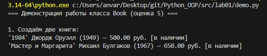
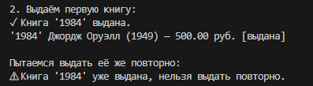
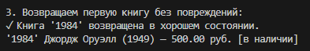
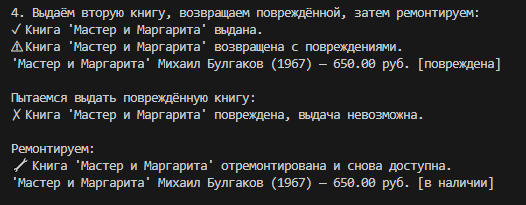
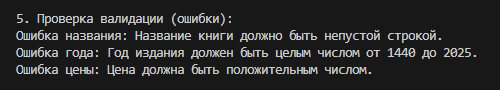

# Лабораторная работа №1: Класс и инкапсуляция (оценка 5)

## Предметная область
**Книга** (класс `Book`).  
Атрибуты: название, автор, год издания, цена, статус (в наличии/выдана/повреждена).

## Мыслительный процесс при проектировании класса

1. **Выбор атрибутов**  
   Книга в библиотеке должна иметь уникальные идентификационные признаки (название, автор, год) и дополнительные характеристики (цена, состояние). Состояние необходимо для отслеживания доступности.

2. **Инкапсуляция**  
   Все атрибуты сделаны закрытыми (`_attribute`), доступ через свойства (`@property`). Это позволяет контролировать изменение данных (например, цена не может стать отрицательной, год – вне диапазона).

3. **Валидация**  
   Логика проверки вынесена в отдельный файл `validate.py` для избежания дублирования. Функции валидации используются и в конструкторе, и в сеттерах.

4. **Логическое состояние**  
   Добавлен атрибут `_status` с тремя возможными значениями. Методы `check_out()`, `return_book()`, `repair()` изменяют состояние и ведут себя по-разному в зависимости от текущего статуса. Это реализует **поведение, зависящее от состояния** – один из принципов объектно-ориентированного проектирования.

5. **Магические методы**  
   `__str__` – человеко-читаемое представление со статусом;  
   `__repr__` – формальное для отладки;  
   `__eq__` – сравнение книг по всем полям.

6. **Бизнес-методы**  
   `apply_discount()` изменяет цену, `is_modern()` – вычисление признака. Они не нарушают инкапсуляцию.

## Ответы на вопросы практического занятия №1

1. **Что такое класс?**  
   Класс – это шаблон (чертёж) для создания объектов, который определяет набор атрибутов и методов, общих для всех объектов этого класса.

2. **Что такое объект (экземпляр класса)?**  
   Объект – это конкретный представитель класса, имеющий собственные значения атрибутов и поведение, заданное классом.

3. **Что такое инкапсуляция и зачем она нужна?**  
   Инкапсуляция – это сокрытие внутреннего состояния объекта и предоставление доступа к нему только через публичные методы. Она нужна для защиты данных от некорректного использования, упрощения поддержки и изменения кода.

4. **Чем отличаются атрибуты класса от атрибутов экземпляра?**  
   Атрибуты класса принадлежат самому классу и разделяются всеми экземплярами (например, счётчик книг `total_books`). Атрибуты экземпляра уникальны для каждого объекта (например, `title`, `author`).

5. **Зачем нужны свойства (`@property`) и сеттеры?**  
   Свойства позволяют управлять доступом к атрибутам, добавляя валидацию, логирование или вычисляемые значения, при этом сохраняя синтаксис прямого обращения (`obj.attr`).

## Скриншоты работы `demo.py`

> *Ниже приведены скриншоты выполнения программы. 

## Скриншоты работы `demo.py`

**Сценарий 1 – создание книг и отображение статуса**  

**Сценарий 2 – выдача книги и запрет повторной выдачи**  

**Сценарий 3 – возврат книги без повреждений**  

**Сценарий 4 – возврат с повреждением и ремонт**  

**Сценарий 5 – проверка валидации**  

## Вывод
В ходе лабораторной работы был создан класс `Book` с полной инкапсуляцией, валидацией данных, логическим состоянием и полиморфным поведением методов в зависимости от состояния.