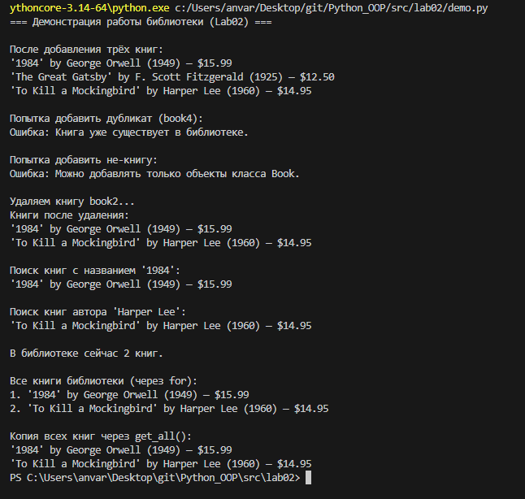

# Лабораторная работа №2: Коллекция объектов (Python 3.x)

## Предметная область
Используется класс **Book** из ЛР-1.  
Контейнерный класс **Library** управляет набором книг.

## Реализованный контейнер
Файл: `src/lab02/collection.py`

### Методы (оценка "3"):
- `add(book)` – добавляет книгу в коллекцию (с проверкой типа).
- `remove(book)` – удаляет книгу.
- `get_all()` – возвращает список всех книг (копию).

### Дополнительно (оценка "4"):
- `find_by_title(title)` – поиск по названию.
- `find_by_author(author)` – поиск по автору.
- `find_by_year(year)` – поиск по году.
- `__len__()` – возвращает количество книг.
- `__iter__()` – поддержка итерации.
- Защита от дубликатов: книги считаются одинаковыми, если совпадают все поля (title, author, year, price). При попытке добавить дубликат выбрасывается `ValueError`.

## Демонстрация
Файл: `src/lab02/demo.py`

Демонстрируется:
- создание книг и библиотеки;
- добавление и удаление элементов;
- попытка добавления дубликата и некорректного типа;
- поиск по различным критериям;
- использование `len()` и цикла `for`.

## Запуск
1. Убедитесь, что файлы находятся в структуре:
python_labs/src/lab02/model.py|collection.py|demo.py

