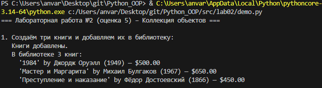
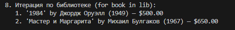

# Лабораторная работа №2: Коллекция объектов (оценка 5)

## Цель работы
Научиться создавать контейнерные классы для хранения объектов, управлять коллекцией (добавление, удаление, поиск), реализовать итерацию и защиту от дубликатов.

## Описание реализованных классов

### Класс `Book` (из ЛР-1)
- Атрибуты: `title`, `author`, `year`, `price`.
- Закрытые поля, свойства, валидация.
- Магические методы `__str__`, `__eq__`.

### Класс `Library` (коллекция)
- Внутреннее хранилище: `self._items: List[Book]`
- **Методы:**
  - `add(book)` – добавляет книгу (с проверкой типа и дубликатов)
  - `remove(book)` – удаляет книгу
  - `get_all()` – возвращает копию списка всех книг
  - `find_by_title(title)`, `find_by_author(author)`, `find_by_year(year)` – поиск
  - `__len__()` – количество книг
  - `__iter__()` – поддержка цикла `for`

### Защита от дубликатов
Книги считаются одинаковыми, если равны все поля (`__eq__` переопределён). При попытке добавить дубликат выбрасывается `ValueError`.

## Демонстрация работы (сценарии из `demo.py`)

### Сценарий 1 – создание и добавление книг
Создаются три книги, добавляются в библиотеку, выводится их список.

### Сценарий 2 – получение всех книг через `get_all()`
Демонстрация метода, возвращающего копию списка.

### Сценарий 3 – предотвращение дубликатов
Попытка добавить книгу с теми же полями отклоняется.

### Сценарий 4 – удаление книги
Удаление одной из книг, повторный вывод коллекции.

### Сценарий 5 – поиск по названию
Поиск книги `1984`.

### Сценарий 6 – поиск по автору
Поиск книг Михаила Булгакова.

### Сценарий 7 – поиск по году
Поиск книг 1949 года.

### Сценарий 8 – итерация через `for`
Использование `__iter__`.

### Сценарий 9 – проверка типа
Попытка добавить строку вместо книги – ошибка.

## Скриншоты работы

Ниже приведены скриншоты выполнения `demo.py` (соответствуют сценариям).

**Сценарий 1 – добавление книг**  

**Сценарий 2 – get_all()**  

**Сценарий 3 – дубликат**  

**Сценарий 4 – удаление**  

**Сценарий 5 – поиск по названию**  

**Сценарий 6 – поиск по автору**  

**Сценарий 7 – поиск по году**  

**Сценарий 8 – итерация**  

**Сценарий 9 – проверка типа**  

## Вывод
В ходе работы был реализован контейнерный класс `Library`, который:
- хранит объекты `Book`,
- управляет добавлением/удалением,
- защищает от дубликатов,
- предоставляет удобные методы поиска и итерации.