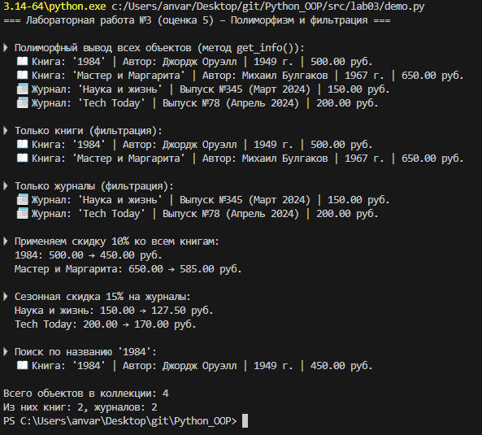

# Лабораторная работа №3: Наследование и полиморфизм (оценка 5)

## Цель работы
Научиться создавать иерархии классов, использовать наследование, полиморфизм без условных операторов, а также реализовать фильтрацию объектов по типу в коллекции.

## Описание реализованной иерархии классов

- **Базовый класс `Media`** (абстрактный) – задаёт общий интерфейс:  
  - атрибуты: `title`, `year`, `price`  
  - абстрактный метод `get_info()` – каждый наследник реализует его по-своему  
  - магические методы `__eq__`, `__str__`

- **Дочерний класс `Book`** – добавляет автора (`author`), метод `apply_discount()`, переопределяет `get_info()`.

- **Дочерний класс `Magazine`** – добавляет номер выпуска (`issue_number`) и месяц (`month`), метод `apply_seasonal_discount()`, переопределяет `get_info()`.

- **Коллекция `MediaCollection`** – хранит любые объекты `Media`.  
  - Добавлена фильтрация по типу: `get_books()` и `get_magazines()`.  
  - Поддерживает итерацию, поиск по названию, добавление/удаление.

## Демонстрация работы (сценарии из `demo.py`)

### Сценарий 1 – Полиморфный вывод
Вызов `item.get_info()` для всех объектов коллекции (книги и журналы) без проверки типов – каждый объект выдаёт свою строку.

### Сценарий 2 – Фильтрация по типу
Использование `collection.get_books()` и `collection.get_magazines()` для получения только книг или только журналов.

### Сценарий 3 – Специфические методы для каждого типа
Применение скидки к книгам (`apply_discount`) и сезонной скидки к журналам (`apply_seasonal_discount`) после фильтрации.

*Ниже приведён скриншот работы `demo.py` (пример вывода):*

## Вывод
В ходе работы было изучено:
- **Наследование** – создание дочерних классов от абстрактного базового класса.
- **Полиморфизм** – вызов одного и того же метода `get_info()` для разных типов объектов даёт разный результат, при этом код не содержит проверок `if type(...)`. Это правильный полиморфизм.
- **Фильтрация коллекции** – методы, возвращающие объекты только определённого типа, что полезно для дальнейшей обработки.
