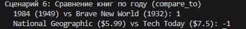

# Лабораторная работа №4: Интерфейсы и ABC

## Цель
Изучить абстрактные базовые классы (ABC), интерфейсы, полиморфизм через контракты.

## Интерфейсы
- `Printable` – метод `to_string()`
- `Comparable` – метод `compare_to(other)`

## Реализация
- `Book` – выводит автора, год; сравнивает по году.
- `Magazine` – выводит номер, месяц; сравнивает по цене.
- `MediaCollection` – фильтрация по интерфейсам, сортировка через `compare_to`.

## Демонстрация (6 сценариев)

### 1. Полиморфный вывод `to_string()`

### 2. Сортировка через `compare_to` (книги по году, журналы по цене)

### 3. Фильтрация объектов, реализующих `Comparable`

### 4. Проверка типов через `isinstance`

### 5. Универсальная печать всех `Printable` объектов

### 6. Прямое сравнение объектов (`compare_to`)

## Вывод
Реализованы интерфейсы, классы их реализуют, коллекция умеет фильтровать и сортировать через интерфейсы. Полиморфизм без `if type()`.