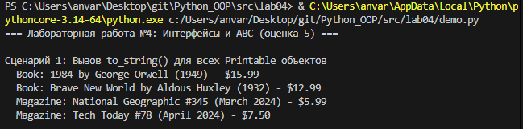
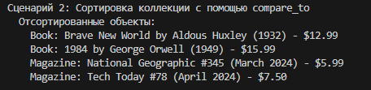
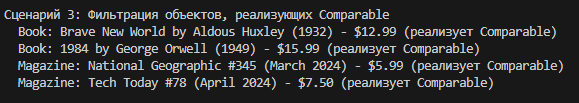
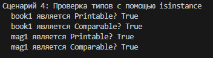
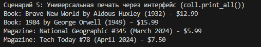

# Лабораторная работа №4: Интерфейсы и ABC

## Цель
Изучить абстрактные базовые классы (ABC), научиться задавать интерфейсы и использовать полиморфизм через контракты.

## Интерфейсы
- `Printable` – метод `to_string()`
- `Comparable` – метод `compare_to(other)`

## Реализация
- `Book` – выводит автора, год; сравнивает по году.
- `Magazine` – выводит номер, месяц; сравнивает по цене.
- `MediaCollection` – фильтрует по интерфейсам и сортирует.

## Демонстрация (5 сценариев)

### 1. Полиморфный вывод через интерфейс Printable
Все объекты вызывают `to_string()` – разный результат.

### 2. Сортировка через Comparable
Книги сортируются по году, журналы – по цене (метод `compare_to`).

### 3. Фильтрация по интерфейсу и проверка `isinstance`
Получение только `Comparable` объектов и проверка принадлежности к интерфейсам.

### 4. Универсальная печать всех `Printable` объектов
Функция `print_all()` использует только интерфейс, без проверки типов.

### 5. Прямое сравнение объектов
Вызов `compare_to` для двух книг и двух журналов.

## Вывод
Реализованы интерфейсы, классы их реализуют, коллекция умеет фильтровать и сортировать через интерфейсы. Полиморфизм без `if type()`.