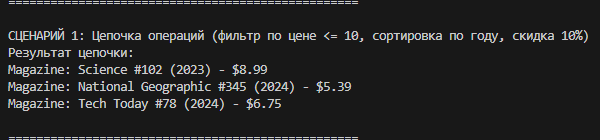
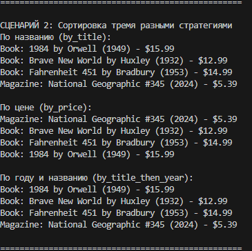
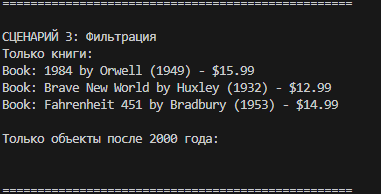
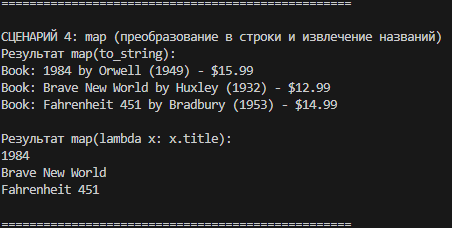
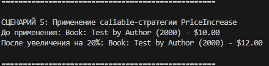
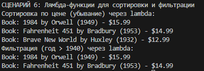

# Лабораторная работа №5: Функции как аргументы. Стратегии и делегаты.

## Цель работы
Освоить передачу функций как аргументов, использовать `map`, `filter`, `sorted`, реализовать паттерн «Стратегия» и интегрировать функциональный стиль с ООП.

## Реализованные функции и стратегии

### Стратегии сортировки
- `by_title`, `by_year`, `by_price`, `by_title_then_year`

### Фильтры
- `is_book`, `is_magazine` – по типу
- `price_less_than(max_price)` – фабрика фильтров
- `year_after(min_year)` – фабрика фильтров

### Преобразования
- `apply_discount(percent)` – фабрика для скидки
- `to_string` – в строку
- `PriceIncrease` – callable-стратегия увеличения цены

### Методы коллекции `AdvancedCollection`
- `sort_by(key_func)` – сортировка
- `filter_by(predicate)` – фильтрация
- `apply(func)` – применение функции ко всем элементам
- `map(func)` – преобразование элементов

## Демонстрация работы

### Сценарий 1 – цепочка filter → sort → apply

### Сценарий 2 – сортировка тремя разными стратегиями

### Сценарий 3 – фильтрация (только книги, объекты после 2000 года)

### Сценарий 4 – использование `map` (преобразование в строки, извлечение названий)

### Сценарий 5 – callable-объект как стратегия (PriceIncrease)

### Сценарий 6 – lambda-функции для сортировки и фильтрации

## Вывод
Изучены передача функций как аргументов, `map`, `filter`, `lambda`, фабрики функций, паттерн «Стратегия» через callable-объекты, цепочки операций над коллекцией.