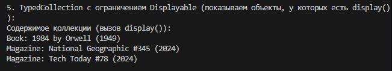
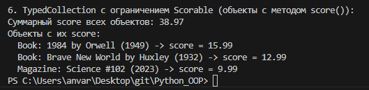

# Лабораторная работа №6: Generics и typing (оценка 5)

## Цель работы
Освоить аннотации типов, generic-классы (`TypeVar`, `Generic`) и структурную типизацию через `Protocol`.

## Реализованные типы и контейнеры

- **`Book`, `Magazine`** – аннотированы все атрибуты и методы.
- **`TypedCollection[T]`** – generic-коллекция с методами `add`, `remove`, `get_all`, `find`, `filter`, `map`.
- **Протоколы** `Displayable` (метод `display()`) и `Scorable` (метод `score()`), а также `TypeVar` с ограничением `bound`.

## Демонстрация

### Сценарий 1 – создание типизированной коллекции

### Сценарий 2.3.4 – методы `find`, `filter`, `map`

### Сценарий 5 – работа с протоколом `Displayable`

### Сценарий 6 – работа с протоколом `Scorable`

## Вывод
Изучены аннотации типов, создание обобщённых классов, структурная типизация через протоколы. Код стал типобезопасным и самодокументируемым.