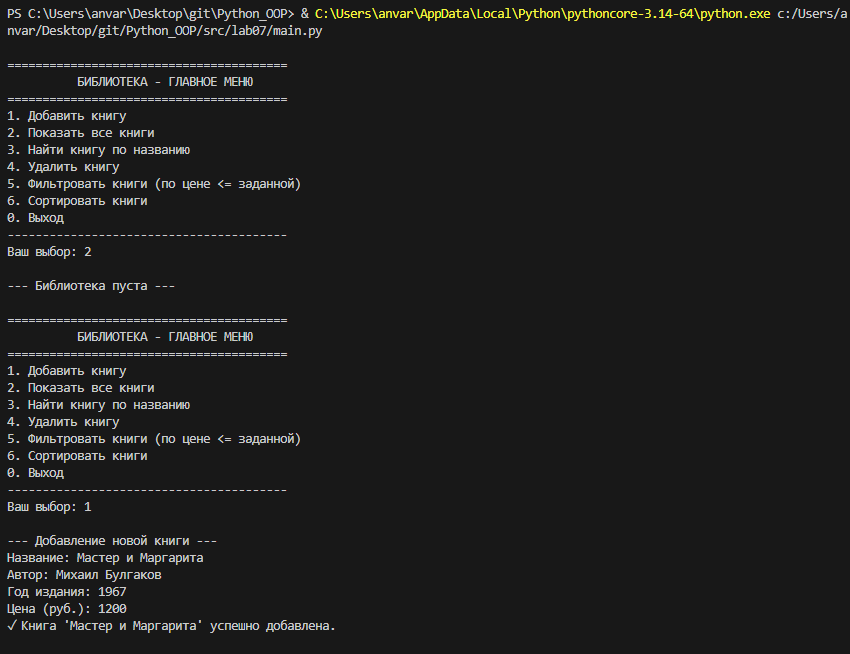
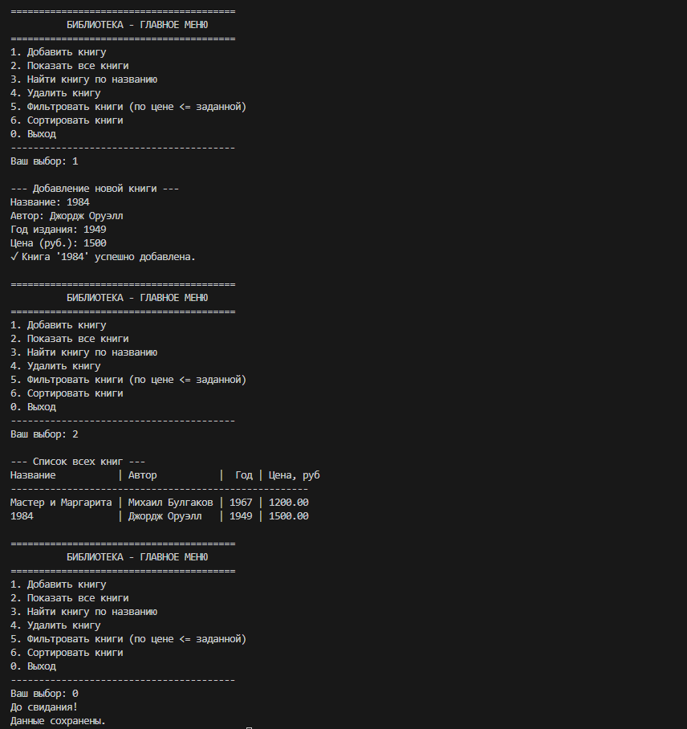
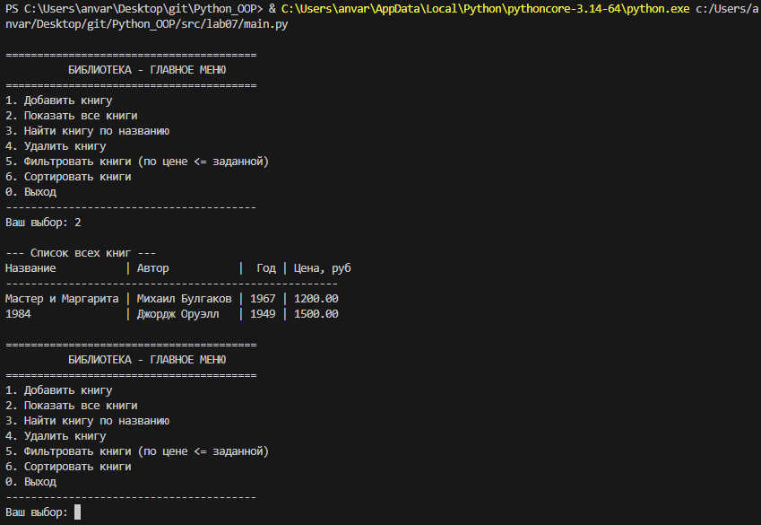
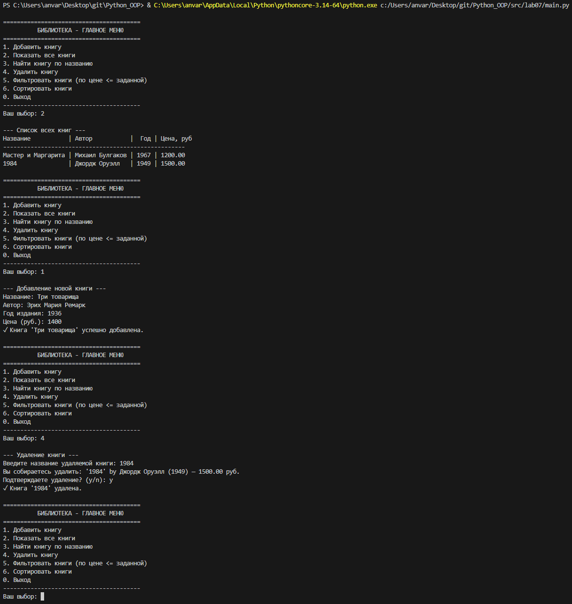
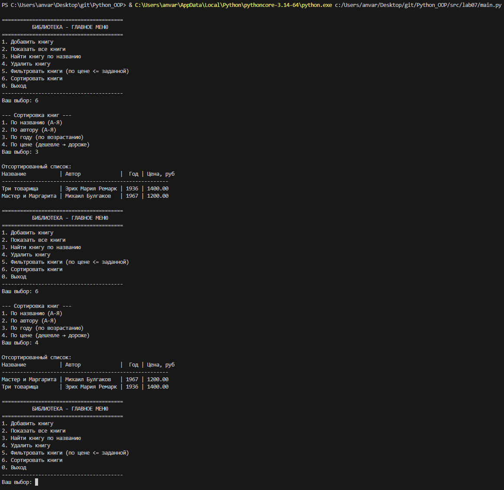
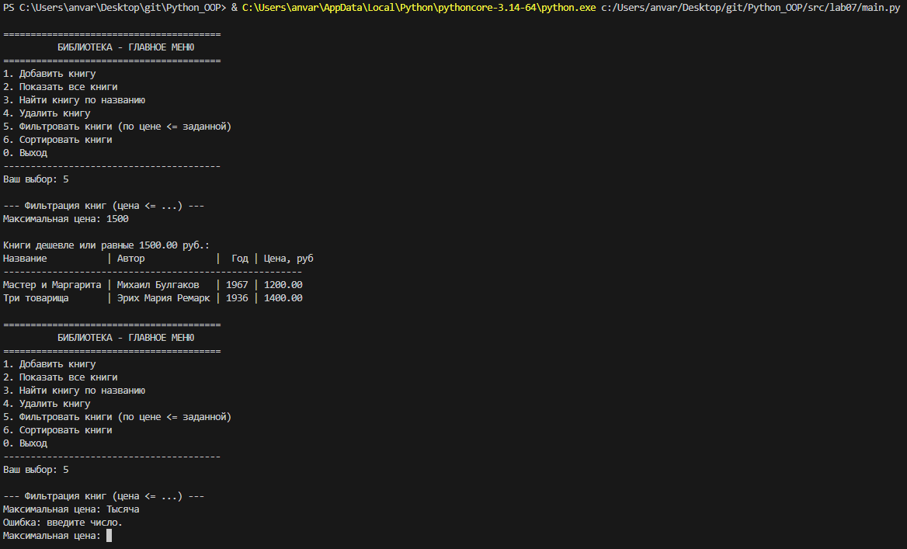

# Лабораторная работа №7: Консольное приложение

## Цель работы
Объединить знания из ЛР1–ЛР6 в единое консольное приложение с интерактивным меню, обработкой ошибок, сохранением/загрузкой данных, фильтрацией, сортировкой и собственной типизацией.

## Реализованная функциональность

- Меню с 7 пунктами (добавление, показ, поиск, удаление, фильтрация, сортировка, выход).
- Собственные исключения: `DuplicateItemError`, `ItemNotFoundError`, `InvalidInputError`.
- Трёхслойная архитектура: `cli.py` (только ввод/вывод), `app.py` (бизнес-логика), `models.py` (модели).
- Сохранение и загрузка в JSON (файл `books.json`).
- Сортировка с выбором стратегии (по названию, автору, году, цене).
- Фильтрация (цена <= заданной).
- Подтверждение удаления.
- Полные аннотации типов и docstring.

## Демонстрация работы (сценарии)

### Сценарий 0 - добавление -> сохранение -> выход 

### Сценарий 1 – запуск, автозагрузка, показ книг

### Сценарий 2 – добавление книги, удаление с подтверждением, сохранение

### Сценарий 2.1 - повторный запуск (данные сохранились)

### Сценарий 4 – фильтрация и обработка исключения (дубликат, неверный ввод)

## Вывод
В ходе работы создано полноценное консольное приложение, использующее все принципы ООП, типизацию, обработку ошибок, паттерны и работу с файлами. Код модульный, расширяемый и документированный.